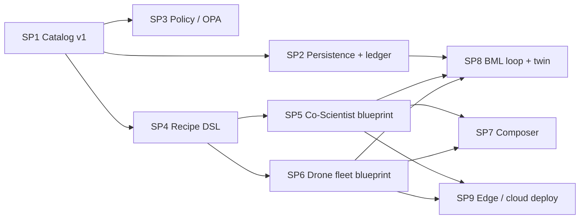

# ADR-0001 — Agentic Patterns Catalog: initial design

Status: Accepted 2026-09-12. **Partly superseded by
[ADR-0002](0002-withdraw-co-scientist-use-case.md) (2026-09-15), which withdraws the Co-Scientist
use case named in the §2 response, §9.1, §9.3 (SP5) and §9.4 option B, and by
[ADR-0003](0003-enrichment-is-the-tracked-record.md) (2026-09-15), which replaces the §7 decision
that the 277 non-pack records stay untracked: all 288 records are tracked, and site content is a
gitignored cache.** The text below is left as written; it records the decision as it was taken. Reviewed section by section; every `Response:` line below is the
reviewer's recorded decision. The consolidated, decision-applied specification is
`docs/superpowers/specs/2026-09-12-agentic-patterns-catalog-design.md`. Later sub-projects (SP2–SP9,
see §9.3) each get their own ADR in this directory.

---


## 0. Decisions already taken and facts verified

Decisions (from the clarification rounds):

| Topic | Decision |
|---|---|
| Kotlin/Embabel role | Consumer agent only; one Python MCP server |
| Auth | Streamable HTTP + Google OAuth via FastMCP OAuth proxy; stdio (no auth) stays the dev default |
| Four new site sections | Mirror now, catalog later; schema carries a `kind` field |
| Mirror scripts | One library + `--section`/`--out` flags on `mirror.py`; no per-section files |
| Publish scope | Code + schema + the 11 free-pack records; the other 277 extracted records stay local |
| Retrieval | Facet filter + BM25 + local embeddings, fused with RRF; all OSS, no API key |
| Repo | New repo `agentic-patterns-catalog`, grounded-context conventions (uv, ruff, Python 3.14, src layout, extras) |
| Enrichment | LLM-drafted, human-reviewed, provenance-tagged per field |

Facts measured or verified on 2026-09-12 (the command or source is named so each can be re-run):

- `pages/clean/patterns/`: 288 pattern pages in 24 categories (+24 category pages, +index). Counted with `find`/`ls`.
- All 288 have `In 30 seconds` (what / when / watchOut), a flow diagram, references and code examples; only 35 have the deep template (Core Mechanism, Workflow/Steps, When NOT to Use, Pitfalls, KPIs, Token/Resource Usage, Best Use Cases). Counted by substring over all 288 files.
- `pages/raw/**` embeds the pattern object in the Next.js RSC payload (`self.__next_f.push`). Keys observed: `tldr{what,when,watchOut}`, `description`, `detailedDescription`, `complexity`, `features`, `useCases`, `whenToUse`, `bestPractices`, `commonPitfalls`, `implementationGuide`, `steps`, `flowScenario`, `initialNodes`, `initialEdges`, `codeExamples{typescript,python,rust}`, `references`, `techniques`, `categories`. Extraction is JSON parsing, not HTML scraping.
- `patterns-pack-free/data/patterns.json`: 11 tool-use records with `id, name, category, categoryName, complexity, description, features, useCases, tldr, example, code, references`. `mcp-server/server.mjs`: Node stdio server, tools `list_categories`, `search_patterns` (keyword-count scoring), `get_pattern`, `get_example`. Pack license: "Free to use in your own projects … The catalog itself stays © KORTEXYA SAS; do not republish it as your own."
- Sitemap fetched once: `ai-red-teaming` 113 pages, `model-architectures` 25, `ai-inference` 21, `fine-tuning` 9. All allowed by `robots.txt`. ~168 pages ≈ 17 min at current politeness settings.
- `mirror.py`: 186 lines, stdlib only, `test_mirror.py` 179 lines. The only `/patterns`-specific code is `pattern_urls()`.
- `grounded-context`: official `mcp>=2.0` SDK (`MCPServer`), stdio, no auth; provenance envelope spec in `docs/specs/provenance.md`.
- `AAAyoutubeRetrieval`: `google_auth_oauthlib.InstalledAppFlow` — Google as an API the script calls, not Google as an identity provider protecting a server. Its client is a Desktop-type OAuth client.
- FastMCP (`prefecthq/fastmcp`, Apache-2.0, v3.x) ships `GoogleProvider` (OAuth-proxy pattern, because Google has no Dynamic Client Registration); tools read `get_access_token().claims["email"]`; v3 requires credentials passed explicitly from `os.environ`. Source: context7 `/prefecthq/fastmcp`, `docs/integrations/google.mdx`.
- Embabel consumes Streamable HTTP MCP servers via Spring AI (`spring.ai.mcp.client.streamable-http.connections.<name>.url`) and exposes them to `@Action`s as tool groups. Source: context7 `/embabel/embabel-agent`, README. NOT verified: whether that client drives the OAuth browser flow itself.

Response: All good.

---

## 1. Architecture

```
agentic-design-mirror (input, local only)      agentic-patterns-catalog (new repo, public)
  mirror.py --section … → <out>/{raw,clean}     ┌─ L0 extract   raw HTML → RSC JSON → pattern records (gitignored)
  patterns-pack-free/  (11 records, licensed)  → │  L0 seed      pack JSON → same schema (committed sample data)
                                                 │  L1 enrich    LLM-draft → human review → selection block + provenance
                                                 │  L2 compile   CATALOG.md, per-category GUIDE.md, reference sheets, embeddings
                                                 └─ L3 serve     CLI `catalog select` ⇄ MCP server (stdio | HTTP+Google OAuth)
                                                                    ↑                 ↑
                                                       Claude Code skill        Python LangGraph agent · Kotlin Embabel agent
```

Five properties borrowed from grounded-context: useful, secure, repeatable, composable,
deterministic-where-it-matters. Concretely: the deterministic path (`get_pattern` by id, facet
filter, BM25) works with a bare install; embeddings are an extra; every answer carries provenance;
one `verify` command checks the whole chain.

Why layers: "hand a catalog to agents so they can pick a pattern" is a retrieval + selection
problem. Storage (JSON) is the easy part. The value is in the selection metadata (L1) and in the
compiled, agent-sized views (L2).

Response: All good.

---

## 2. Data model

One record per pattern, `catalog/patterns/<category>/<slug>.json`, validated by
`schema/pattern.schema.json` (JSON Schema 2020-12). Pydantic models are the in-code source of
truth; the schema file is generated from them and a test asserts the committed schema equals the
generated one.

```
id, name, category, kind (pattern|technique|benchmark|tool), complexity
content:   description, tldr{what,when,watchOut}, features[], useCases[], whenToUse[], bestPractices[],
           commonPitfalls[], steps[], example, code{ts,py,rs}, references[], flow{nodes[],edges[]}
selection: problem_signals[], preconditions[], contraindications[],
           facets{scale, latency_cost, token_cost, risk_class, maturity}   ← closed enums
           relations[{type: alternative_to|composes_with|requires|precedes, target, prefer_when}]
provenance: source{url, mirrored_at, extraction: "rsc-payload"|"free-pack", content_sha256}
            enrichment{method: llm-draft|human|derived, model, date, reviewed_by|null}   ← per selection field
```

- `content.*` keeps the field names of the pack's `patterns.json` (cited as origin) so the 11 pack
  records load unchanged.
- `catalog/index.json` lists every id + `content_sha256` + enrichment review status: the freshness
  and coverage ledger.
- Relations form a graph stored as edges on the source node. A compile step checks that every
  `target` resolves and that `precedes` is acyclic (the DAG).
- Decision trees are NOT stored. `GUIDE.md` per category is compiled from facets +
  `alternative_to`/`prefer_when`. A tree is a frozen tag filter; tags stay correct when pattern 289
  is added.
- The flow `nodes/edges` is the per-pattern mechanism (the FSM). It passes through untouched.

Where each representation fits:

| Representation | Used for | Not used for |
|---|---|---|
| JSON records + JSON Schema | Source of truth, validation, compiling other views | Direct reading by an agent |
| Faceted tags | Selection: filter by problem signals and constraints | Order or composition |
| Decision tree (compiled view) | Per-category chooser, 3-6 questions | Global navigation over 288 nodes |
| DAG / graph | Relations between patterns; composition recipes | Selecting one pattern |
| FSM | A pattern's runtime mechanism (existing flow nodes/edges) | Catalog structure |

Response:
- All good.
- Consider also mapping this to different persistence patterns with Postgres which runs locally to either serialize the JSON directly and/or leverage other facilities like vectors, checkpointing, etc. This may be helpful with observability to track provenance, activity.
- For overall governance, I want to use OPA rego where possible and need to learn more about it.
- Celery is installed locally and may come in useful for pub/sub ops. 
- I am building this catalog so I can try example use cases. First use case: analyze biomedical test results using AI, following the Google AI Co-Scientist paper (`/opt/devel/DevMoi/agentic-design-mirror/goggle_ai_coscientist.pdf`), which describes a pattern for a digital scientific lab for R&D (supervisor, generation, reflection, ranking tournament, proximity, evolution and meta-review agents over an asynchronous task framework with context memory). This catalog work is my own second iteration on that public paper; no prior code is reused. Another use case that will be applied will be drone fleet management including flight plan and real time operations of the fleet and each individual drone. For details on the drone fleet use case, see: 
/opt/devel/DevMoi/Comprehensive Drone Flight Plan Template.md
/opt/devel/DevMoi/FlightPlanTemplate.md
/opt/devel/DevMoi/DroneControlSW.02.md
/opt/devel/DevMoi/drone_flightplan_usecase (1).md
/opt/devel/DevMoi/drone_sora_hazards_bundle.md
/opt/devel/DevMoi/blog_08_fleet_architecture_outline (1).md

- Also take into account: 
/opt/devel/DevMoi/blog_05_composable_secure_workloads_draft.md 
/opt/devel/DevMoi/blog_outline_sgp_grounding_gap.md
/opt/devel/DevMoi/ContextualAgentSecurityAPolicyForEveryPurpose.pdf
/opt/devel/DevMoi/blog_09_digital_twin_simulation_draft.md


- The ultimate goal is to build building blocks similar to Spring Integration and its more modern equivalent at https://spring.io/projects/spring-cloud so I can start with a catalog of patterns, present a formal use case description and the system builds a set of agents to implement the use case: once built an instance can run and can be put through a lean cycle of BML (Build, Measure, Learn) to iterate on the instance and improve currently deployed instances. Once built an instance can be monitored, measured, improved, deployed to the cloud or at the edge for IOT use cases.
- I was thinking of using Apache Airflow for DAGs if not overkill.

---

## 3. Retrieval + MCP server

Tools (names compatible with the pack's server, plus one): `list_categories`, `search_patterns`,
`get_pattern`, `get_example`, `select`.

`select(task, facets?, k=5)`: facet pre-filter → BM25 (`rank_bm25`, MIT) ∥ embeddings (`fastembed`,
Apache-2.0, local ONNX) → RRF → top-k. Each hit carries `score_bm25`, `score_semantic`, `rrf_rank`,
`retrieval_path`, the record's `provenance`, and its 1-hop relations. Empty result →
`"No pattern matches in the catalog."` — never invented; same rule as grounded-context.

Server: FastMCP v3 (Apache-2.0). The same server object runs as:
- stdio, no auth — dev default, registered in `.mcp.json`;
- Streamable HTTP on `localhost:8000` with
  `GoogleProvider(client_id, client_secret, base_url, required_scopes=[openid, email])`, values
  read from env.

AuthZ: `CATALOG_ACCESS="alice@x.com:curator,bob@y.com:reader"` → role. Each tool declares a
required role. A middleware reads `get_access_token().claims["email"]`, maps to role, denies with
a structured error otherwise.

Google Cloud needs a Web-application OAuth client with redirect `http://localhost:8000/auth/callback`.
Assumption: the YouTube `client_secret.json` is a Desktop client, so a new client is required.
Check: client type in the Google console.

Tokens never enter the repo (`.env.example` only). Every answer's provenance includes
`catalog_version` (git sha of the data) and `auth: {subject: email | "stdio-local"}`.

Response: All good.

---

## 4. Mirror refactor (agentic-design-mirror)

- `pattern_urls(sitemap)` → `section_urls(sitemap, section)`.
- CLI: `python3 mirror.py --section ai-red-teaming --out redteaming`. Defaults `--section patterns
  --out pages`, so current behaviour is unchanged. Output keeps `raw/` + `clean/` under `--out`.
- Tests: extend `test_mirror.py` with section filtering for all five sections against a fixture
  sitemap, and `--out` path handling. Existing tests unchanged.
- Decision: no library swap. Politeness, backoff and robots handling are ~60 tested stdlib lines;
  `protego`/`requests` would add dependencies without changing behaviour. Stated in the README.
- Four documented invocations:

  | Section | `--out` | Pages (sitemap 2026-09-12) |
  |---|---|---|
  | `ai-red-teaming` | `redteaming` | 113 |
  | `ai-inference` | `inference` | 21 |
  | `fine-tuning` | `fine-tuning` | 9 |
  | `model-architectures` | `model-architectures` | 25 |

Response: All good.

---

## 5. Consumers

- Claude Code skill `skills/agentic-patterns/SKILL.md`, progressive disclosure:
  SKILL.md (when to use; the 4-step contract: read CATALOG.md → open GUIDE.md or call `select` →
  apply the full record → check contraindications) → `CATALOG.md` (one line per pattern; size is
  measured and asserted under a token budget) → `guides/<category>.md` → full record via MCP or
  the compiled reference sheet (format borrowed from the pack's `markdown/tool-use/*.md`, cited).
  All produced by `catalog compile`; nothing under `skills/**/generated/` is hand-edited.
- Python agent (`agents/python/`, LangGraph): node 1 calls `select`; node 2 drafts an application
  plan citing pattern ids; node 3 checks contraindications and emits the provenance block. Model
  via env. The retrieval step runs against the stdio server with no key.
- Kotlin agent (`agents/kotlin/`, Embabel + Spring AI MCP client): the same three steps as
  `@Action`s under one `@Goal`; MCP connection = the HTTP server URL in `application.yml`. Auth for
  this client is the one open verification (see §0).
- CrewAI is out: one Python framework is enough to compare with Embabel.

Response: All good.

---

## 6. Enrichment + evaluation

- `catalog enrich --category routing` drafts the `selection` block with Claude from `content.*`
  only. The prompt is committed; model id and date are recorded in `provenance.enrichment`. Output
  is a review file; `catalog review` sets `reviewed_by`. Unreviewed fields are served but flagged
  `"reviewed": false` in every envelope.
- Golden set `eval/tasks.jsonl`: ~30 task descriptions × expected pattern id(s) × expected route
  facts. `catalog eval` writes `docs/data/eval.json` (a record, never prose) and runs three arms
  (BM25, semantic, RRF) so the hybrid gain is measured, not assumed.
- Cheapest early test of the whole idea (before investing in enrichment): compile `CATALOG.md`
  from `tldr` alone, give an agent 5 tasks, check whether it picks a sensible pattern.
- Enrichment priority: routing, workflow-orchestration, multi-agent, tool-use, memory-management,
  fault-tolerance-infrastructure, planning-execution; ui-ux-patterns and benchmark-kind entries last.

Response: All good.

---

## 7. Verification, licensing, out of scope

- `uv run catalog verify`: schema validation of every record; index ↔ files consistency; relation
  targets resolve; `precedes` acyclic; `CATALOG.md` within budget; compiled files match a fresh
  compile; eval within declared tolerance. CI runs it on the 11 committed records; locally on all 288.
- Repo contents: code, schema, prompts, the 11 pack records (pack README quoted as license),
  enrichment for all 288 in the author's words, compiled CATALOG/GUIDE lines that quote only
  `id`/`name` + enrichment. Extracted `content.*` for the other 277 is gitignored and rebuilt with
  `catalog extract --mirror ../agentic-design-mirror`. Attribution to agentic-design.ai in the
  README and in every record's `provenance.source.url`.
- Out of scope for v1: multi-tenant, hosted deployment, the four new sections in the catalog
  (schema has `kind` ready), a Kotlin server, CrewAI, LLM reranking.
- Toolchain: Python 3.14 + uv. `[project] dependencies` = pydantic + rank_bm25 only. Extras:
  `embed` (fastembed), `mcp` (fastmcp), `agent` (langgraph), `dev`, `lint`. Kotlin: JDK 21,
  Gradle, Embabel via `embabel/kotlin-agent-template`.

Response: All good.

---

## 8. Build phases (proposed order, each with its check)

1. Mirror refactor + run the four sections. Check: tests pass; page counts match §4.
2. Schema + extractor + pack seed. Check: 288 + 11 records validate; coverage report per field.
3. `CATALOG.md` compiler + the 5-task smoke test from §6. Check: recorded verdicts.
4. Selection schema + enrich `routing` end to end (9 patterns), GUIDE.md, relations. Check: the
   5-task test again; precision delta recorded.
5. `select` (BM25 → +embeddings → RRF) + golden set + `catalog eval`. Check: `eval.json` written.
6. MCP server stdio, then HTTP + Google OAuth + role middleware. Check: denied/allowed cases tested
   with a fake token verifier; one manual browser login recorded in docs.
7. Claude Code skill; Python LangGraph agent; Kotlin Embabel agent. Check: each reaches the same
   answer + provenance for the golden tasks.
8. Enrichment across priority categories; `catalog verify` in CI.

Response:
- New repo to reside in: /opt/devel/DevMoi/agentic-patterns-catalog
- In Python repo, use ruf before commiting anything to git. I added it to item 7 in the table at the beginning of this doc.
- Git repo is to use MIT license.
- Create an architecture diagram in Mermaid format in /opt/devel/DevMoi/agentic-patterns-catalog/docs/architecture.mmd
- Do take note of my note on line 7 of this doc.
- Ask for clarifications.

---

## 9. Round 2 — scope widening from the §2 response (recap + four questions)

### 9.1 What the referenced material is (surveyed 2026-09-12)

- The Google AI Co-Scientist paper describes a multi-agent digital lab: supervisor → generation →
  reflection → tournament ranking → proximity → evolution → meta-review, over an asynchronous task
  framework with Elo-rated context memory. That agent set and framework are the generic pattern the
  catalog must be able to express; the biomedical use case is one application of it.
- The drone documents already map the flight plan to the "flagship pattern" (task → controls →
  risk register → autonomic layer → generated artifact → evidence → HITL sign-off → BML) and
  describe an 8-step agent workflow (Knowledge → Plan → Validate → Score → Document → Sign-off).
  `drone_sora_hazards_bundle.md` (path corrected) specifies an OKF bundle slice: SORA regulation,
  SAIL risk, hazards index with mitigation → maps-to → residual risk.
- Conseca paper (Tsai & Bagdasarian, HOTOS '25, CC-BY 4.0): per-task, just-in-time security
  policies generated from *trusted* context only and enforced *deterministically*. Natural OPA/rego
  fit: an LLM drafts the policy, OPA evaluates it, the enforcement point never sees untrusted context.
- Blogs 05 / 08 / 09 and the SGP outline: composable field-to-cloud workloads, five agentic
  functions, portability matrix, digital twin as the *Measure* stage of BML.

### 9.2 Assessment

This is now a program, not one spec. The v1 catalog as designed is sub-project 1. The ultimate goal
(use case → composer builds agents → instance → BML loop → deploy cloud/edge) is a
Spring-Integration-style platform in which the catalog is the component registry and a "recipe" is
the flow DSL.

Recommendation: keep v1 bounded; add two things that strengthen v1 without widening it (Postgres and
OPA behind interfaces, defaults unchanged); bring the two use cases in as **recipes + golden eval
tasks** (they prove the catalog can express them, without building them); record everything else
as numbered sub-projects, each with its own ADR. Push-back: **Celery** and **Airflow** have no job
in v1 — enrichment is a batch CLI and the catalog's DAGs are data, not scheduled work; both belong
to the Co-Scientist / BML sub-projects.

### 9.3 Sub-projects and what can run in parallel (answers the Q1 parallelism question)

Proposed decomposition. Each row is one ADR + one spec + one repo or one top-level directory.

| # | Sub-project | Produces | Hard dependency on |
|---|---|---|---|
| SP1 | Catalog v1 (§1–§8) | records, `select`, MCP server, skill, two consumer agents | — |
| SP2 | Persistence + activity ledger (Postgres, pgvector, LangGraph checkpointer) | `Store` + `Ledger` interfaces, Postgres impl | SP1 schema (pydantic models) only |
| SP3 | Policy layer (OPA/rego; later Conseca-style per-task policies) | `PolicyDecisionPoint` interface, rego bundle, `opa test` | SP1 MCP middleware seam only |
| SP4 | Recipe DSL (use case → ordered pattern set + bindings) | `recipe.schema.json`, two recipes | SP1 pattern ids + relations |
| SP5 | Co-Scientist blueprint (generic digital lab from the Co-Scientist paper, Celery task framework) | reusable agent library + reference instance | SP4 recipe; SP1 `select` |
| SP6 | Drone fleet blueprint (flight plan → validate → SORA score → sign-off; PX4 SITL) | reference instance + OKF bundle | SP4 recipe; SP1 `select` |
| SP7 | Composer (use case description → agent set) | generator that emits an SP5/SP6-shaped instance | SP4 + one working blueprint |
| SP8 | BML loop + digital twin (Measure/Learn, Airflow-or-Prefect decision) | telemetry, eval harness, redeploy | SP2 ledger + one blueprint |
| SP9 | Edge / cloud deploy (portability matrix) | packaging, deployment targets | one blueprint |

Parallelism, given the table:

- **Can start now, in parallel with SP1:** SP2 and SP3, as soon as SP1's schema and middleware
  seams exist (SP1 phase 2 and phase 6 in §8 — a few days in). They are independent of each other.
  SP4 can start after SP1 phase 2 (pattern ids stable).
- **Can start in parallel with each other, after SP4:** SP5 and SP6. They share nothing except the
  recipe schema and `select`.
- **Serial:** SP7 needs one blueprint to copy from; SP8 needs SP2's ledger and one blueprint; SP9
  needs one blueprint.
- **Learning-driven parallel track:** SP3 (rego) is the best candidate for a side track you work on
  alone while SP1 proceeds — it is small, has its own test tool (`opa test`), and has one integration
  point.
- **Practical limit:** two to three active sub-projects at once; each parallel track needs a shared
  contract (the interface it plugs into) written before it starts, which is what
  `~/.claude/agent_docs/multi-agent-workflow.md` calls Tier 1 `contracts.md`.

Dependency graph (Mermaid; also the seed for `docs/architecture.mmd` in the new repo):



Response: Proceed as described.

### 9.4 Q1 — How should the v1 spec absorb the new scope?

| Option | What it means |
|---|---|
| **A. Bounded v1 + roadmap of sub-projects (recommended)** | v1 = catalog + consumers as designed, plus Postgres and OPA as optional backends behind interfaces, plus the two use cases as recipes + golden tasks. SP5–SP9 become numbered sub-projects with their own ADR/spec (table in §9.3). |
| B. v1 + Co-Scientist blueprint | Also spec the generic digital-lab building blocks from the Co-Scientist paper in v1. Doubles the first spec; catalog and blueprint ship together. |
| C. One program spec now | Spec the whole platform (catalog → composer → BML → deploy) in one document, then plan phases. Most upfront design, highest rework risk. |

Response: A

### 9.5 Q2 — What role does Postgres play in v1?

Note: the `postgres` MCP server failed to connect in this session (`CONNECTION_CLOSED`). Is the
local instance running, and is `pgvector` installed?

| Option | What it means |
|---|---|
| **A. Optional backend behind a `Store` interface (recommended)** | JSONB pattern records + pgvector embeddings + an append-only `activity` table (every `select`/tool call with subject, args, hits, provenance) + LangGraph Postgres checkpointer for the Python agent. File-based store stays the bare-install default; `verify` runs against both. |
| B. Primary store, required | Postgres is the source of truth; files are an export. Simpler code path, but breaks the zero-dependency deterministic path. |
| C. Activity ledger only | Records stay files; Postgres only receives the provenance/activity log. Smallest step toward observability. |

Response: (1) A and (2) pgvector is installed. Local pgsql running is version 18.6. I may need to reset the mcp server as I just setup version 18.6. Give me instructions for how to reset the mcp server to point to the right pgsql instance.

### 9.6 Q3 — How should OPA/rego enter v1?

| Option | What it means |
|---|---|
| **A. OPA as the AuthZ decision point (recommended)** | The MCP middleware calls a `PolicyDecisionPoint` interface. Implementations: static allowlist (default) and OPA over HTTP to a local `opa run --server`. Policies in `policy/*.rego`, `opa test` in CI. Conseca-style per-task policy generation is SP3's second phase. |
| B. AuthZ + result gating | As A, plus rego evaluates `select` hits against task facets (e.g. deny patterns whose contraindications match declared constraints). More rego to learn from, more coupling. |
| C. Defer OPA to SP3 entirely | Keep the email→role middleware in v1; learn rego when the policy layer is built. |

Response: A

### 9.7 Q4 — Celery and Airflow in v1?

| Option | What it means |
|---|---|
| **A. Neither in v1 (recommended)** | Celery goes to SP5 (its async task framework). Airflow is re-evaluated in SP8 against lighter options (Prefect, LangGraph). Both recorded as decisions in the ADR. |
| B. Airflow for enrich → compile → eval now | Model the catalog build pipeline as an Airflow DAG from the start. Adds a scheduler + metadata DB to a 5-minute in-process chain. |
| C. Celery for async enrichment now | Run LLM enrichment drafts as Celery tasks over Redis. Adds a broker to a batch job that runs a few times. |

Response: A

### 9.8 Smaller items from the §8 response (noted, no question)

- New repo path: `/opt/devel/DevMoi/agentic-patterns-catalog` (does not exist yet; will be created).
- `ruff` before every commit; MIT license; `docs/architecture.mmd` in Mermaid.
- This document becomes ADR-0001 in the new repo (`docs/adr/0001-catalog-design.md`); later
  sub-projects get ADR-000n. Confirm or name another location.
- `goggle_ai_coscientist.pdf` is at `/opt/devel/DevMoi/agentic-design-mirror/`, not under the new repo path.

Response: Everything is where it should be, proceed.
